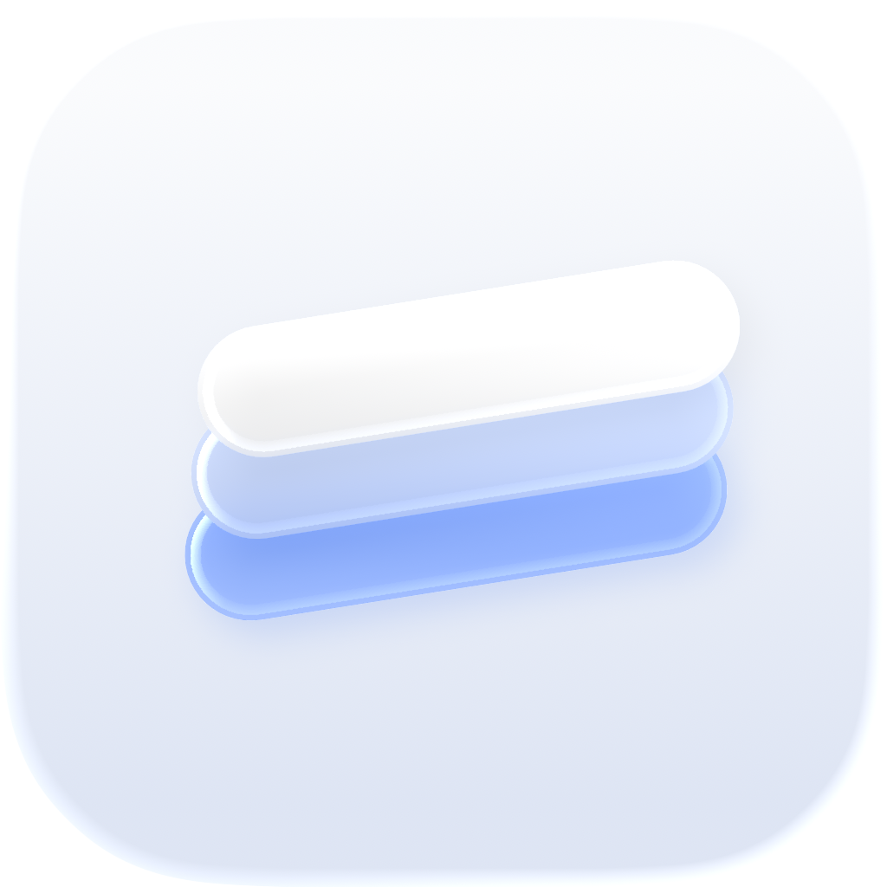

  <picture>
    <source media="(prefers-color-scheme: dark)" srcset="app-icon-dark.png" />
    
  </picture>

  <strong>Saylo</strong> 
  On-device voice dictation for Mac.

## Features

- **On this Mac** — Apple Speech turns what you say into text. Nothing leaves the machine. No account, no cloud transcript, no audio archive.
- **Menu bar** — No Dock icon. Press the Dictation Trigger, talk, then press again or tap Stop.
- **Glass HUD** — A floating bar in the middle of the screen: a live waveform, or the words as they are recognized.
- **Copy or paste** — Finish copies by default, or paste into the field that had focus.
- **Your trigger** — Hold, press, or double-press. A second language always has its own key.
- **Read Aloud** — Speaks the current selection with an Apple system voice. Personal Voice is optional and stays on-device.
- **Insights** — Local counts of words, sessions, and speaking time.
